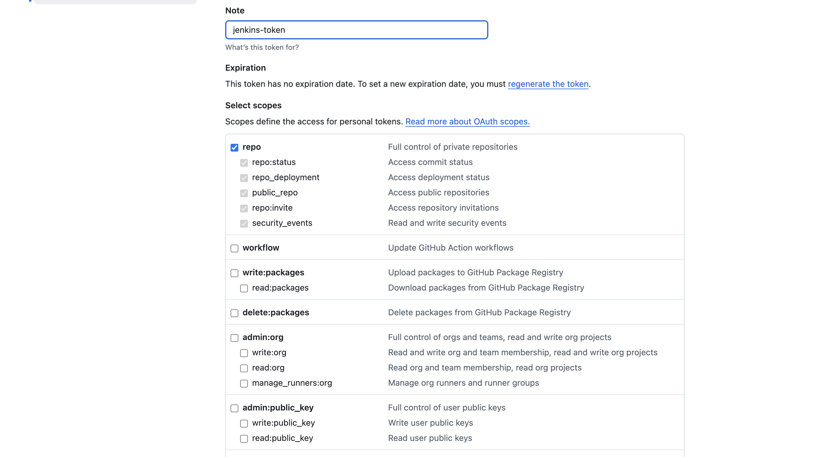
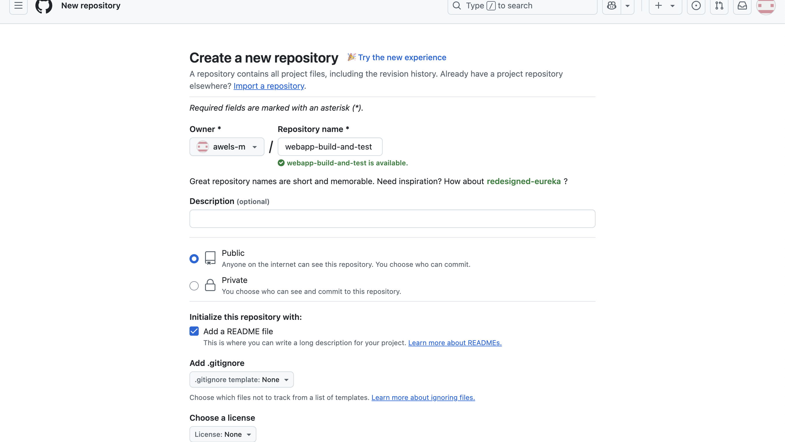
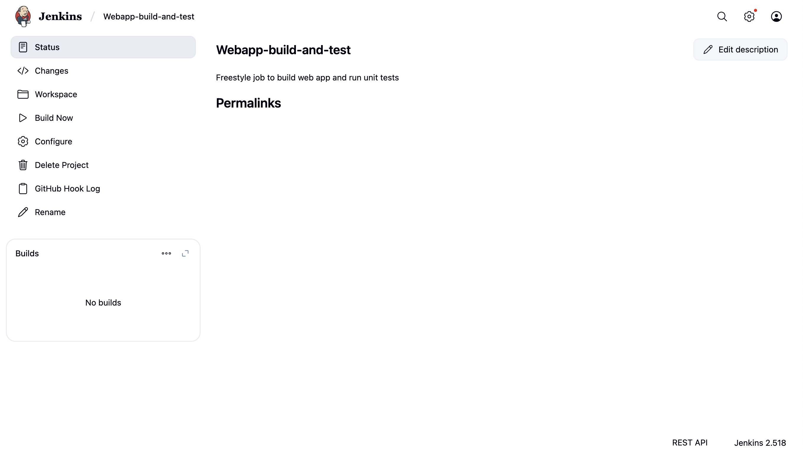
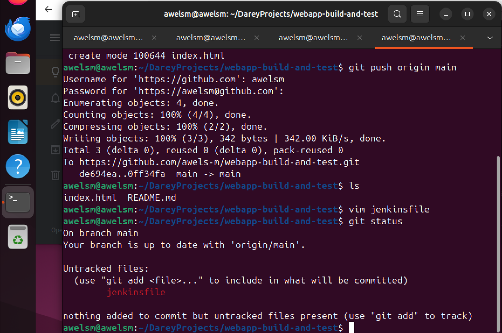
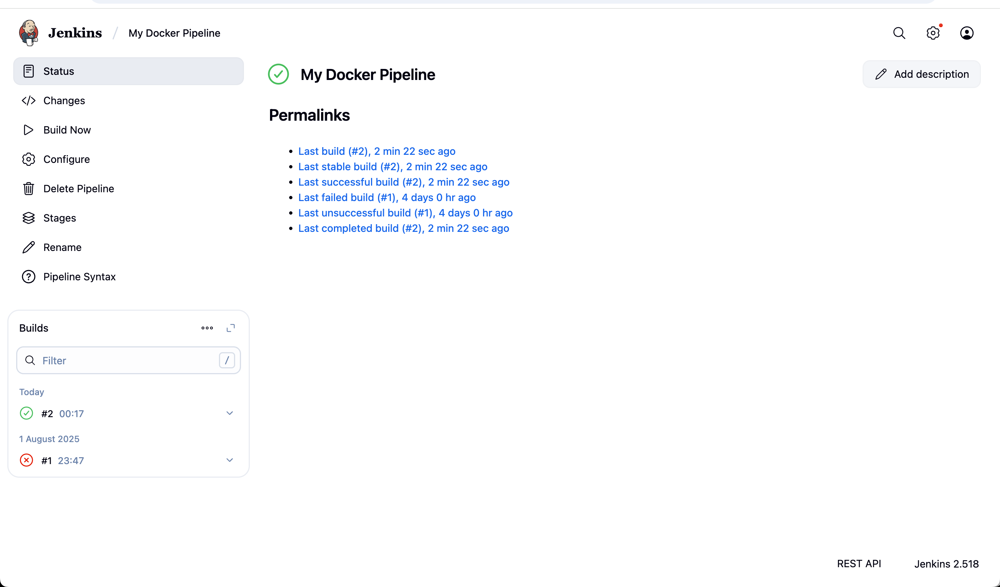
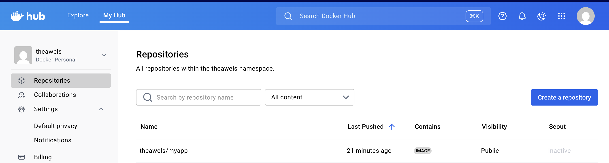

# automating-deployment-of-an-E-commerce
## INTRODUCTION
Here i will be documenting in a detailed form for each jenkins component setup and also explanation of security measures implemented at each step

## PRE-REQUISITE
- kniwledge of jenkins essentials
- completion of jenkins, jenkins freestyle project and jenkins pipeline job mini projects
  
  ## PROJECT DELIVERABLES
- DOCUMENTATION
    - Detailed documentation for each jenkins component setup 
    - Explanation of security measures implemented at each steps
- DEMONSTRATION
    - Live demonstration of CI/CD pipeline
  
## Objective
- To build and automate a CI/CD pipeline for a static web application using Jenkins and Docker, ensuring:
- Continuous Integration
- Continuous Deployment
- Image build and push to DockerHub
- Live deployment on port 8080

# A. JENKINS SERVER SETUP
OBJECTIVE- Configure Jenkins server for CI/CD pipeline automation

## the steps
- install jenkins on a dedicated server 
- set up necessary plugins (Git, Docker, etc)
- Configure Jenkins with required security measures

# FIRST STEP - INSTALL JENKINS ON A DEDICATED SERVER 

the first thing to do is to run the command "sudo apt update" this command is used to make sure all the packages are up to date. after which i moved to the second step which is sudo apt update && sudo apt -y upgrade
sudo reboot
 
 these commands helps to make sure that all packages are u to date and upgraded and rebooted. 
 
 
 
 
 

 ## B. VirtualBox NAT port‑forwarding 
 since i am using my virtual machine, 
 VM ➜ Settings ➜ Network ➜ Adapter 1: NAT ➜ Advanced ➜ Port Forwarding…

Add rule:

Name: jenkins

Protocol: TCP

Host IP: 127.0.0.1

Host Port: 8080

Guest IP: (leave blank)

Guest Port: 8080

You’ll then open http://localhost:8080 on your Mac.

Alternative (Bridged networking): Get the VM’s IP with ip -4 addr show and open http://<vm-ip>:8080 in your browser.

## Install Java & Jenkins (LTS)
Jenkins needs Java. Install OpenJDK 17, add the official Jenkins apt repo, then install Jenkins and start it.

### 1. Java
sudo apt -y install openjdk-17-jre

### 2. Jenkins repository key + list (official LTS channel)
curl -fsSL https://pkg.jenkins.io/debian-stable/jenkins.io-2023.key | sudo tee /usr/share/keyrings/jenkins-keyring.asc > /dev/null
echo "deb [signed-by=/usr/share/keyrings/jenkins-keyring.asc] https://pkg.jenkins.io/debian-stable binary/" | sudo tee /etc/apt/sources.list.d/jenkins.list > /dev/null

### 3. Install Jenkins
sudo apt update
sudo apt -y install jenkins

### 4.  Start & enable on boot
sudo systemctl enable --now jenkins
sudo systemctl status jenkins --no-pager

the image below depicts this 

#### Firewall (if ufw is enabled):
sudo ufw allow 8080/tcp

#### First login:

Open http://localhost:8080 (or http://<vm-ip>:8080).

Get the one‑time admin password:

sudo cat /var/lib/jenkins/secrets/initialAdminPassword
Paste it in the browser, select Install Suggested Plugins, then create your admin user

the omage below depicts this 

### Why these steps?
Java is the Jenkins runtime.
Using the Jenkins LTS apt repo keeps you on stable updates.
systemctl enable --now ensures Jenkins persists across reboots.

## B.  Core plugins & tool configuration
A. System packages you’ll use from Jenkins
Install Git and (optionally) unzip/curl if you don’t have them already.

sudo apt -y install git curl unzip
git --version

## C. NEXT STEP - Install plugins (Manage Jenkins ➜ Plugins ➜ Available)
Search and install (then Restart Jenkins when prompted):
Git (usually preinstalled; ensures full Git features)
Pipeline + Workflow Aggregator (Jenkinsfile pipelines)
GitHub Integration (if using GitHub webhooks, checks, etc.)
Credentials Binding (store tokens/passwords safely)
SSH Agent (use SSH keys for repo access)
Docker and Docker Pipeline (to run Docker commands in pipelines)

(Optional) Blue Ocean (nicer UI for pipelines), ThinBackup (quick config backups), Role‑based Authorization Strategy (fine‑grained permissions).

## D. NEXT STEP - Configure global tools
Manage Jenkins ➜ Tools (Global Tool Configuration):
Git: If Jenkins shows “Install automatically” you can leave it; or set path to /usr/bin/git.
JDK: Select “Use system Java” (OpenJDK 17).
Leave others default for now (you can add Node/Gradle later as needed).

### Why these plugins?
Git + Pipeline are your CI/CD backbone.

Docker plugins let you build/run containers from Jenkins.

Credentials Binding/SSH Agent keep secrets out of your Jenkinsfile.

GitHub Integration helps PR checks and webhooks.

### NEXT STEP -Install Docker and allow Jenkins to use it
By default, the jenkins service user can’t talk to Docker. You’ll install Docker Engine, add jenkins to the docker group, and restart services so group membership applies.

### Install Docker Engine (official repo)
i first created a file and included the neccessary command as seen in the images below. i went ahead to make sure that i gave myself the right to execute the file and then i went ahead to execute the file as seen in the images below

### Remove old docker packages (no output if not installed)
sudo apt remove -y docker docker-engine docker.io containerd runc || true

## Set up repository
sudo apt -y install ca-certificates curl gnupg
sudo install -m 0755 -d /etc/apt/keyrings
curl -fsSL https://download.docker.com/linux/ubuntu/gpg | sudo gpg --dearmor -o /etc/apt/keyrings/docker.gpg
echo \
  "deb [arch=$(dpkg --print-architecture) signed-by=/etc/apt/keyrings/docker.gpg] https://download.docker.com/linux/ubuntu \
  $(. /etc/os-release && echo "$VERSION_CODENAME") stable" | sudo tee /etc/apt/sources.list.d/docker.list > /dev/null

sudo apt update
sudo apt -y install docker-ce docker-ce-cli containerd.io

## Start & enable Docker
sudo systemctl enable --now docker
sudo systemctl status docker --no-pager

### Let Jenkins use Docker

# Add the 'jenkins' user to the 'docker' group
sudo usermod -aG docker jenkins

# Restart both so the service picks up new group membership
sudo systemctl restart docker
sudo systemctl restart jenkins

# Confirm group assignment
id jenkins | tr ' ' '\n' | grep docker || echo "docker group not effective yet"
the images below depicts this

if you see “permission denied while trying to connect to the Docker daemon socket” in a build:

Ensure /var/run/docker.sock is owned by root:docker and mode 660:
ls -l /var/run/docker.sock

Verify jenkins is in the docker group (id jenkins)

Restart Jenkins after adding the group (systemctl restart jenkins)

4) Minimum security hardening (safe defaults)
Manage Jenkins ➜ Security:

- Jenkins URL:
Manage Jenkins ➜ System ➜ Jenkins Location ➜ set to the exact URL you’ll use (e.g., http://localhost:8080/ or http://<vm-ip>:8080/).
This fixes links in emails/webhooks.

- Disable signup:
Ensure only your admin can create users. Under Security, make sure “Allow users to sign up” is off.

- Authorization mode:
For a solo box, Logged‑in users can do anything is fine.
If you add teammates, install Role‑based Authorization Strategy and set:

- Admin role (you)
Developer role (read + build)

Viewer role (read only)

#### CSRF Protection:
Keep “Prevent Cross Site Request Forgery exploits” enabled (default).

#### Credentials management best practice:

Store all tokens/SSH keys in Manage Jenkins ➜ Credentials.

Use Credentials Binding or sshagent{} in pipelines.
Never hardcode passwords or tokens in Jenkinsfiles.

### Backups:

Quick win: install ThinBackup plugin (or periodically tar /var/lib/jenkins).
/var/lib/jenkins contains jobs, credentials metadata, plugin state, etc.

If you’ll expose Jenkins to the internet:

Put Nginx in front with HTTPS (Let’s Encrypt).

Restrict by IP allowlist or VPN.

Change the default 8080 to something non‑default and keep auto‑updates on.

In conclusion, 
Jenkins Server Setup (What I did & Why)

OS & Host: Ubuntu 22.04 server on VirtualBox (NAT, host port 8080 ➜ guest 8080) to open Jenkins at http://localhost:8080.

Java: Installed OpenJDK 17 (required runtime for Jenkins).

Jenkins (LTS): Added official apt repo, installed Jenkins, enabled it as a service for auto‑start on reboot.

Core Plugins: Git, Pipeline, GitHub Integration, Credentials Binding, SSH Agent, Docker, Docker Pipeline (to support Git SCM, Jenkinsfile pipelines, GitHub webhooks, secure secret handling, and Docker builds).

Global Tools: Git (/usr/bin/git), system JDK 17.

Docker: Installed Docker Engine from Docker’s official repo, added the jenkins user to the docker group, restarted Docker and Jenkins so pipelines can run docker commands without sudo.

Security: Disabled public sign‑ups, enforced login, kept CSRF protection on, set Jenkins URL under Manage Jenkins ➜ System, stored all secrets in Credentials (never in Jenkinsfiles).

Backups: Noted /var/lib/jenkins as the config root; optional ThinBackup plugin.

Verification: Created a pipeline that prints git --version, docker --version, and runs docker run --rm nginx:alpine nginx -v. All steps succeeded.

# Part 2 — Source Code Management (SCM) Integration
## Goal
Connect Jenkins to your repo so it can pull code and trigger builds automatically on every push (webhooks). I’ll show GitHub first (most common), then note Bitbucket differences.

## Step 2.1 — Create a GitHub Personal Access Token (PAT)
- Log in to your GitHub account.

- Click on your profile icon (top-right corner).

- Select Settings → Developer settings → Personal access tokens.

- Click Generate new token → Generate new token (classic).

- Name the token clearly (e.g., jenkins-token).

- Set the Expiration (choose as desired or select "No expiration" for ease).

- Under Select scopes, tick:
repo (full control of private repositories)

- Scroll down, click Generate token.

- Copy the token immediately (you'll paste it in Jenkins soon—store safely).

the images below depicts this

## Step 2:2 - Add GitHub Credentials to Jenkins
- Log into your Jenkins server (e.g., http://localhost:8080/).

- Click Manage Jenkins → Manage Credentials → (global) → Add Credentials.

- Select:
Kind: Username with password
Username: your GitHub username
Password: paste your GitHub PAT here.
ID: type a clear identifier like github-credentials
Description (optional): e.g., "GitHub PAT for Jenkins integration"

- Click OK to save credentials.

the images below depicts this 

# PART 3 - JENKINS FREESTYLE JOB FOR BUILDS AND UNITS TEST
## OBJECTIVE: CREATE JENKINS FREESTYLE HOB FOR BUILDING A WEB APPLICATION AND RUNNING UNITS TEST
## Step 3: Set up the webhook in GitHub

- Go to your GitHub repository homepage.

- Click Settings (tab on the repository page, NOT your profile settings):

- Look at the tabs at the top of your repository (Code | Issues | Pull requests | Actions | Projects | Wiki | Security | Insights | Settings).

- Click the "Settings" tab.

On the left sidebar, click Webhooks.

- Click the green "Add webhook" button.

## Step 4: Fill in the Webhook form
- Payload URL: Enter exactly (use your real public URL or ngrok UR)
Content type:
Select "application/json".

- Secret: (Optional)
You can leave this blank for now, or add a secret.
(If you add a secret here, you must also enter it in your Jenkins GitHub plugin configuration.)

- Events:
Under "Which events would you like to trigger this webhook?":
Select "Just the push event" (default).

- Ensure the webhook is "Active" (box checked).

- Click the "Add webhook" button at the bottom.

the images below depicts this

## CREATNG OF FREESTYLE JOB ON JENKINS
- Step 1: Create a Freestyle Job in Jenkins
Log in to your Jenkins dashboard (e.g., http://localhost:8080 or your public URL).

- Click New Item from the Jenkins homepage.

- Enter a clear, descriptive name for your job (e.g., webapp-build-and-test).

- Select Freestyle project, then click OK.

- Step 2: General Settings of the Freestyle Job
On the next configuration page, you'll see several sections. Go through them carefully:

- Description (Optional):
Type a simple description (e.g., "Freestyle job to build web app and run unit tests").

- Discard old builds (Optional but recommended):

- Check this option.

Enter "Max # of builds to keep": 10.
(This ensures Jenkins keeps your workspace tidy by automatically deleting old builds.)

it is important to note that i went ahead to create a github repository as seen in the images below 

I then went ahead to add the git hub reposiory link into the freestyle job i created on my docker as seen in the images below 

i went ahead to configure the freestyle job by changing the branch to main in other to suit my github repository. i also went ahead to add webhook to my newly created git hub repository. 
on the payload url i imputed the jenkins url gotten from using ngrok on my terminal and also enabled the SSL verification and asked thewebhook to trigger build by clicking on "Just push the event" and further clicked on active. All these can be seen in the images below

the webhook was successfully created and then i went back to my jenkins where i was configuring my freestyle job and made some changes just like in the environment where i clicked "delete workspace before build". i also incleded a script into the execute shell and saved it. the images below depicts this.

i went ahead to edit the shell script to suit the projet that i am working on. the image the below depicts this 

### Cloning of the github repository. 
i went ahead to clone the github repository on my linux terminal and then i went ahead to cd into it and created an index.html file using vim and then imputed the content as seen in the image below and then i went ahead to save the changes and used git add . as well as git commit -m and git push origin main. this new changes went ahead to trigger build on my jenkins and the build was successful. all these can be seen in the images below. 

## PART 4: JENKINS PIPELINE FOR WEBAPPLICATION

I first created a file called "Jenkinsfile" on my github repository via my terminal and imputed contents that suits the project. the images below depicts this 

i then went ahead to add the file and committed the changes as well as pushed the changes to main. the images below depicts this

### Explanation of Jenkinsfile Steps Clearly:
- Checkout Code: Jenkins fetches your latest code from GitHub automatically.

- Build Application: Ensures your main file (index.html) exists.

- Unit Tests: Performs a simple "unit test" by checking if the <html> tag exists.

- Deploy Web Application: Copies index.html to the web server directory (/var/www/html) and restarts the NGINX server to make changes live.
  
### Jenkins Pipeline Documentation
- Job Name: webapp-pipeline

- Pipeline Source: Pipeline script from SCM (Git)

- SCM Repository URL: your GitHub repo URL clearly stated

- Branch: main

- Script Path: Jenkinsfile

- Pipeline Stages:
Checkout from GitHub
Build application (verify file existence)
Run basic HTML unit test
Deploy web application by copying index.html to NGINX directory and restarting NGINX

- Trigger: Automatic webhook from GitHub push event

as stated in the project objective. i went ahead to create a pipieline job and then named it webapp-pipeline

i filled up the description and all neccesary parts as seen in the images below. i changed the brcanch to main and went ahead to save it. 

i successfully connected my jenkins pipeline job to my github repository to be able to do this part of the project and i also confirmed that the script path says 'Jenkinsfile' but it failed. the image below depicts this

### SOLUTION

Test Failed: HTML tag missing!
ERROR: script returned exit code 1
Stage "Deploy Web Application" skipped due to earlier failure(s)

This simply means that the test was looking for the <html> tag inside your index.html file, and it couldn’t find it.

hence, i tried to fix this cleanly and get my Jenkins Pipeline to build successfully.

this is because, In your Jenkinsfile, I have this line during the Unit Test stage: grep -q "<html>" index.html. That command searches your index.html file for the <html> tag. If it doesn't find it, the test fails with exit 1.

#### Why Did It Fail?
There are only two possible reasons:

- My index.html file does not contain the exact string <html>.

- My index.html file has it written differently, for example with uppercase (<HTML>) or with spaces (< html>), or maybe it's a React/Vue component and not a plain HTML file.

i firstly went into my index.html and editted the content of the file as seen in the images below 

i then went ahead to add the changes, commit the changes and push the changes to main as seen in the image below

i also noticed from the console output that Jenkins is not allowed to use sudo without entering a password and since there’s no interactive terminal in a Jenkins pipeline, it fails.

### What You Need to Do (Fix It in 2 Steps)
- Step 1: Allow the Jenkins User to Run cp and systemctl Without Password
I had to update the sudoers file to allow Jenkins to run only these safe commands without a password:

- I had to also Be careful when editing this file — mistakes can lock me out.

- Here's how to do it:
On my Jenkins server terminal (SSH in if remote): sudo visudo
This opens the sudoers file in safe edit mode.

- At the bottom of the file, add this exact line: jenkins ALL=(ALL) NOPASSWD: /bin/cp, /bin/systemctl restart nginx

##### EXPLANATION
- jenkins — the user Jenkins runs as

- NOPASSWD: — don't prompt for a password

- /bin/cp and systemctl restart nginx — only these commands are allowed without a password

- save and close
  the images b elow depicts this
  
  
  
  

  i went ahead to test the sudo priviledge manually using the command: sudo -u jenkins /bin/cp /path/to/your/test.html /var/www/html/test.html
if it works silently with no password promt, it means that i am good to go
or run this command: sudo visudo -c

the image below shows that it was successfull

i went ahead to also install nginx. i first ran a general update using the command; sudo apt update, sudo dpkg --configure - a before i went ahead to install the nginx and got it running. the images below depicts these

I went ahead to click build and it was successful as seen in the image below

### CREATING A WEBHOOK TO TRIGGER BUILD.
I went ahead to create a webhook to be a able to trigger build. the images below depicts it. 

i went ahead to make changes so that it can help trigger build. the images below depicts this

then i went ahead to configure my jenkins job to set it in such a way that the webhook would work. the images below depicts this

# part 5 -

## Project Step: Docker Image Creation and Registry Push with Jenkins
### Objective:
- I want Jenkins to automatically:

1. Build a Docker image of your web app

2. Run it locally in a container

3. Test it in the browser

4. Push that Docker image to Docker Hub (or another registry)

### Step by Step Beginner Friendly Breakdown
1. Install Docker on the Jenkins Server
Jenkins needs Docker installed to build and run images.
- I Ran these on my Jenkins server:

sudo apt update
sudo apt install docker.io -y
sudo systemctl start docker
sudo systemctl enable docker
Add jenkins to the docker group so it can run Docker without sudo:
sudo usermod -aG docker jenkins

- Restart Jenkins and your system to apply the group changes.

2. Create a Dockerfile in Your Project
   firstly, i made sure that my nginx was successfully created. 
   i went ahead to also install nginx. i first ran a general update using the command; sudo apt update, sudo dpkg --configure - a before i went ahead to install the nginx and got it running. the images below depicts these

CREATING A DOCKERFILE

In the root of my project (alongside index.html ), I created a file named: Dockerfile and imputed the content below 

# Dockerfile

FROM nginx:alpine
COPY index.html /usr/share/nginx/html/index.html

This creates a Docker image based on NGINX and replaces the default page with my index.html.

the images below depicts this

3. Write a Jenkinsfile (Pipeline Script)
Add a Jenkinsfile in my project repo. i imputed this command into the Jenkinsfile that i just created. below is what i imputed into the Jenkinsfile: 
pipeline {
    agent any

    environment {
        IMAGE_NAME = 'your-dockerhub-username/mywebapp'
        DOCKER_CREDENTIALS_ID = 'docker-hub-creds'
    }

    stages {
        stage('Checkout Code') {
            steps {
                git url: 'https://github.com/your-repo/webapp-project.git', branch: 'main'
            }
        }

        stage('Build Docker Image') {
            steps {
                script {
                    sh 'docker build -t $IMAGE_NAME .'
                }
            }
        }

        stage('Run Container Locally') {
            steps {
                script {
                    sh 'docker run -d -p 8080:80 --name mywebapp_container $IMAGE_NAME'
                }
            }
        }

        stage('Push to Docker Hub') {
            steps {
                script {
                    docker.withRegistry('https://index.docker.io/v1/', "$DOCKER_CREDENTIALS_ID") {
                        sh "docker push $IMAGE_NAME"
                    }
                }
            }
        }
    }

    post {
        always {
            sh 'docker rm -f mywebapp_container || true'
        }
    }
}

the images below depicts this 

## NEXT STEP - Create Jenkins Credentials for Docker Hub
I first went ahead to log in to my docker to keep it running as seen in the images below

the next thing i went ahead to do is to create jenkins credentilas for my doker hub. 

i went to:

Jenkins → Manage Jenkins → Credentials → Global → Add Credentials

- Kind: Username and Password

- Username: Your Docker Hub username

- Password: Your Docker Hub password or access token

- ID: docker-hub-creds (match what's in the Jenkinsfile)
  
  the images below depicts this 
  
  
  
  
  

  I went ahead to chanhge the content of my Jenkins file as seen in the images below 
  
  
  
  
  

  ### RE-EDITING MY Jenkinsfile
  i went ahead to make changes on my Jenkinsfile. this is because I noticed some errors. the images below depicts this
 
  
  

  i went ahead to add my changes, commited my new changes and pushed it to the main branch as seen in the image below 

  

  ### Configure Jenkins Pipeline Job
- Go to Jenkins dashboard

- Click New Item

- Name it something like webapp-docker-pipeline

- Choose Pipeline

- Scroll to the Pipeline script section and either:
Use "Pipeline script from SCM" if it's in GitHub
Or paste the Jenkinsfile directly into the textbox

- Then click Save.
the images below depicts this 

this however failed as seen in the images below. 

I went ahead to confirm Jenkins user can run docker 
i needed to make sure the Jenkins user has permission to run Docker commands — either by being in the docker group or using sudo.

- Step-by-step Check:
- Step 1: Find out the Jenkins user
On many systems, Jenkins runs as a user called jenkins. I confirmed by running the command. the image below depicts this

- Step 2: Check if jenkins can run Docker
Run this command: sudo -u jenkins docker ps
If it works (shows an empty or populated container list), Jenkins can run Docker.

If I see: Got permission denied while trying to connect to the Docker daemon socket...

Then Jenkins doesn’t have permission yet.

however, it shows that jenkins can run on my docker as seen in the image below

I clicked build but it ended up failing as seen n the console output as seen in the image below 

Everything built perfectly — the Docker image was created successfully. But it failed at the container run stage because port 8080 is already in use on your Jenkins server. Let’s quickly sort that out and get your build flowing smoothly!

The error: failed to bind host port for 0.0.0.0:8080: address already in use

Meaning?
It means another container (or app) is already using port 8080 on your machine. Since Docker tries to bind your container’s port 80 to host port 8080, it fails when that port is busy.

## SOLUTION:
- Option 1: Stop the Existing Container on Port 8080
Let’s check and stop any container already using port 8080.

🔍 Step 1: Check what’s running by using this command 'sudo lsof -i :8080'
the image below depicts this 

i went ahead yto open my Jenkinsfile and Instead of using port 8080 (already occupied), I decided to use something else. 
the images below depicts this

i went ahead to add the changes, committed the changes and pushed the changes to main as seen in the image below

i went ahead to click build and it was finally sucessful. the images below depicts this

# CONCLUSION 
I successfully created a fully functional CI/CD pipeline for a static web application using Jenkins and Docker. Beginning with a fresh GitHub repository (webapp-build-and-test), I validated the application, packaged it into a Docker image based on nginx, deployed it on a secure host port (8090), and pushed the image to Docker Hub under theawels/myapp:latest. Throughout the process, I tackled and resolved practical challenges, including credential errors, sudo permission issues, missing services, port conflicts, and VirtualBox NAT network limitations. Each challenge deepened my understanding of CI/CD workflows, containerization, Linux permissions, and virtualization. The end result is a reusable pipeline where every GitHub commit triggers Jenkins to build, run, and publish the app, making it accessible via a web browser. This serves as a strong base to expand into features like automated testing, build notifications, webhook triggers, and cloud-based deployments.